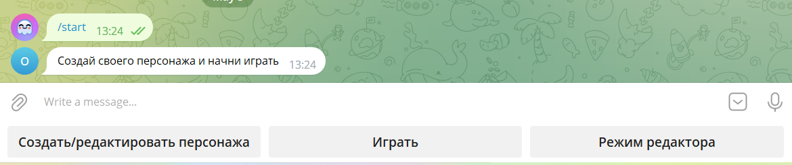
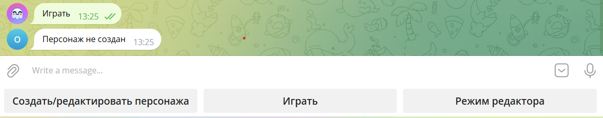
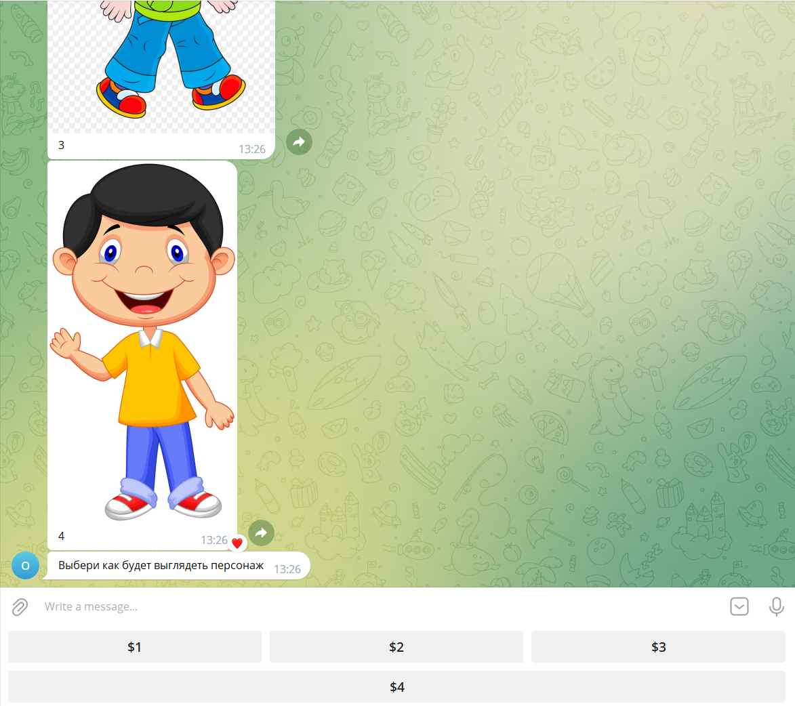
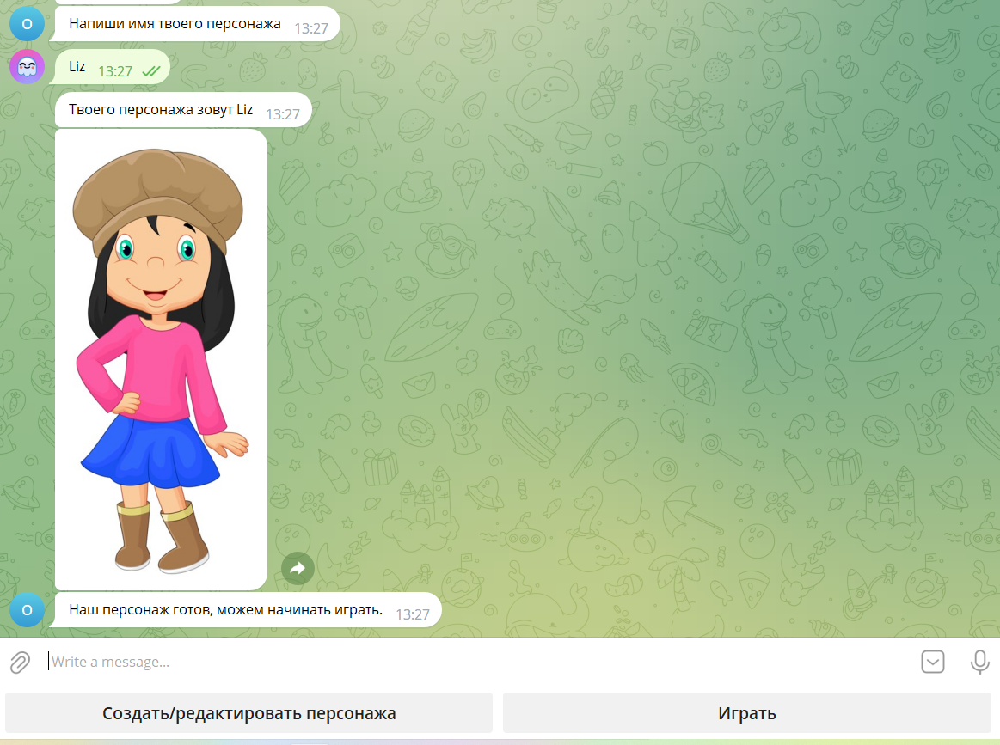
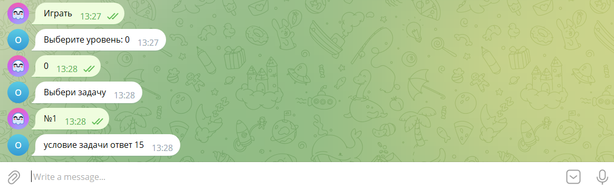
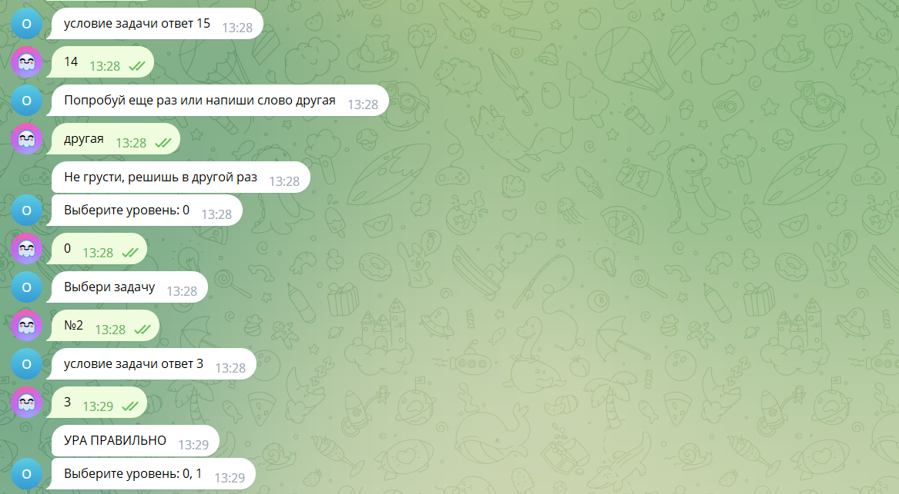
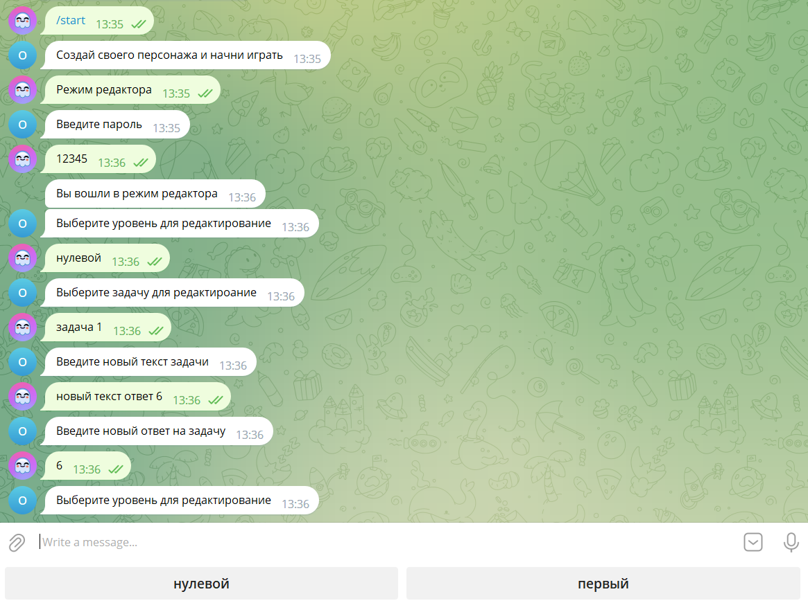
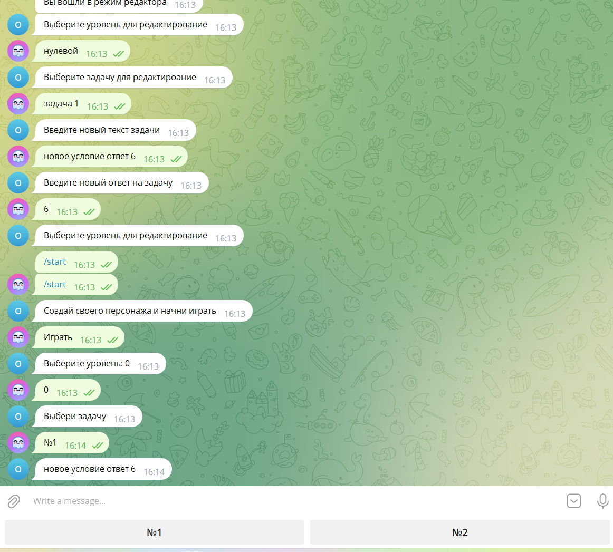

# Bot

Телеграмм бот для решения задач. 

https://t.me/Olympiad_game_bot

Чтобы запустить бот необходимо вставить ваш токен и файлы constant и main, запустить файл main.py и написать в бот /start

Поддерживает выбор персонажа и редактирование персонажа(создание персонажа необходимо для начала)

Накопление бонусных очков, которые открывают новые уровни.

Также поддерживается режим редактора, в котором можно изменять условия и ответы текущих уровней

---
> Чтобы выйти из режима редактора нужно два раза написать в бот /start

---
Пароль от режима редактора 12345

